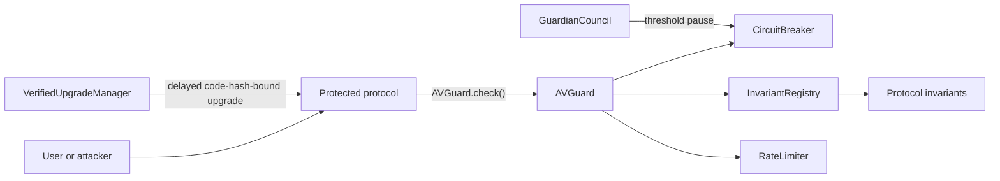

# AV Upgrade

**Auto-Verify Upgrade (AV Upgrade)** is an experimental, modular runtime defense
layer for EVM protocols. It lets a protected contract enforce invariants, cap
outflows, enter an emergency pause, and accept only scheduled implementation
code hashes.

> [!WARNING]
> This repository is an unaudited research prototype. Do not use it to secure
> production funds.

AV Upgrade does not claim to detect every exploit or determine whether a caller
is a hacker. It blocks transactions that violate explicit, deterministic safety
policies and gives independent guardians a separate path to contain an active
incident.

## Why

AI-assisted vulnerability discovery is reducing the time between a bug becoming
discoverable and being exploited. Audits remain necessary, but protocols also
need controls that limit what a single transaction or short attack window can
do.

AV Upgrade adds defense in depth:

- **Runtime invariants** reject calls that violate protocol-specific rules.
- **Rate limits** cap per-transaction and rolling-window outflows.
- **Circuit breakers** stop protected functions after a confirmed incident.
- **Guardian voting** requires a configurable threshold to trigger a pause.
- **Verified upgrades** bind a scheduled upgrade to an exact implementation
  code hash, calldata hash, delay, and execution window.

## Architecture



The protected protocol calls `AVGuard.check` before committing a sensitive
operation. If any configured policy rejects the call, the whole transaction
reverts.

Pausing is intentionally separate. An EVM transaction cannot both persist a
pause and revert the exploit, because a revert rolls back every state change.
AV therefore uses deterministic checks to stop the current call and a distinct
guardian transaction to persist an emergency pause.

## Contracts

| Contract | Responsibility |
| --- | --- |
| `AVGuard` | Entry point used by protected contracts |
| `InvariantRegistry` | Maps protected functions to up to eight invariants |
| `RateLimiter` | Enforces per-call and rolling-window outflow limits |
| `CircuitBreaker` | Stores persistent target pause state |
| `GuardianCouncil` | Collects on-chain guardian votes and triggers pauses |
| `VerifiedUpgradeManager` | Executes delayed upgrades only for scheduled code |

The demo includes:

- `VulnerableVault`: contains a deliberate missing-authorization bug.
- `ProtectedVault`: contains the same bug but routes the withdrawal through AV.
- `WithdrawalAuthorizationInvariant`: blocks unauthorized account withdrawals.
- `SolvencyInvariant`: ensures a withdrawal does not create insolvency.

This deliberate example demonstrates the framework. Production contracts should
still implement authorization directly and use AV as an additional layer.

## Run

Foundry is the only requirement.

```bash
forge fmt --check
forge test --offline
```

The suite proves that:

1. An attacker drains the unprotected demo vault.
2. The same call reverts against the AV-protected vault.
3. Valid withdrawals continue to work.
4. Oversized outflows are contained.
5. A guardian threshold persists a pause.
6. Upgrade execution is delayed and bound to an exact code hash.

## Integration Sketch

```solidity
VaultContext.Withdrawal memory context = VaultContext.Withdrawal({
    caller: msg.sender,
    account: account,
    balanceBefore: address(this).balance,
    liabilitiesBefore: totalLiabilities,
    amount: amount
});

avGuard.check(msg.sig, amount, abi.encode(context));
```

For a real integration:

1. Identify every value-moving or privilege-changing function.
2. Define properties that must remain true for each function.
3. Register small, reviewable invariant contracts.
4. Configure conservative per-call and rolling-window limits.
5. Put all admin roles behind hardened multisigs and timelocks.
6. Test liveness, false positives, compromised guardians, and upgrade failure.
7. Obtain independent audits before deployment.

## Scope

AV Upgrade can contain violations represented by configured policies. It cannot:

- infer arbitrary unknown vulnerabilities on-chain;
- guarantee that malicious activity is always distinguishable from valid use;
- protect contracts that do not integrate the guard;
- repair compromised private keys or governance;
- make an unsafe invariant, oracle, admin, or upgrade secure;
- replace audits, formal verification, monitoring, or incident response.

See [THREAT_MODEL.md](docs/THREAT_MODEL.md) for security assumptions and
[LAUNCH_THREAD.md](docs/LAUNCH_THREAD.md) for the draft public announcement.

## Status

Version `0.1.0` is a proof of concept intended for review, adversarial testing,
and design discussion.

## License

MIT

